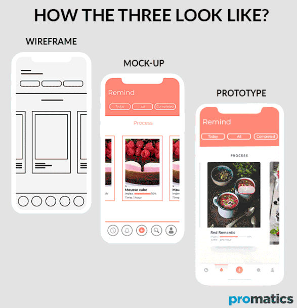

# Class 04

## Wireframe & Design

Wireframes are a way for UI/UX designers to layout an example of how they want a website to look. 

They are very high level and serve as a basic template with little detail included. These are a pre-cursor to a mockup which comes before the prototype which again comes before the website itself.

There are some great tools out there to make Wireframes with such as [Invision](https://www.invisionapp.com/), [Lucid Charts](https://www.lucidchart.com/pages/) and [Balsamiq](https://balsamiq.com/) to more advanced applications such as [Adobe XD](https://www.adobe.com/uk/products/xd.html) and [Figma](https://www.figma.com/).